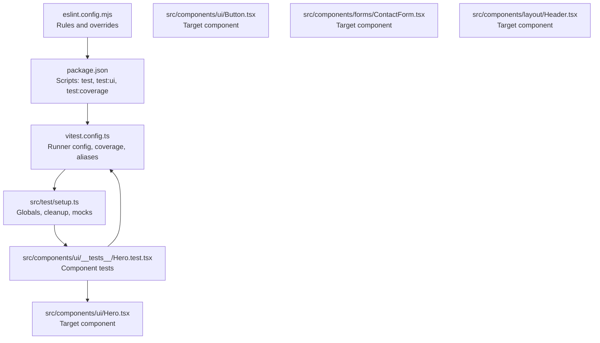
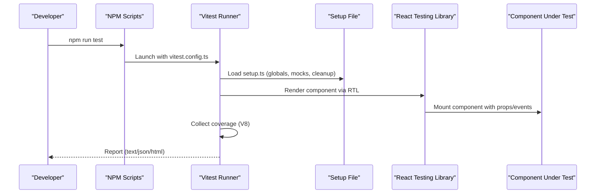
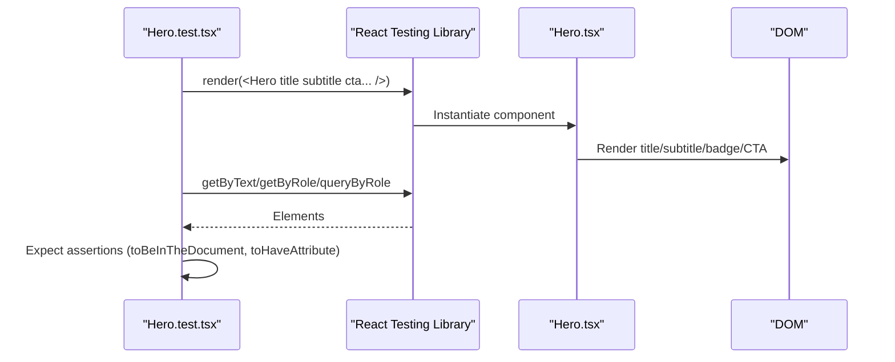
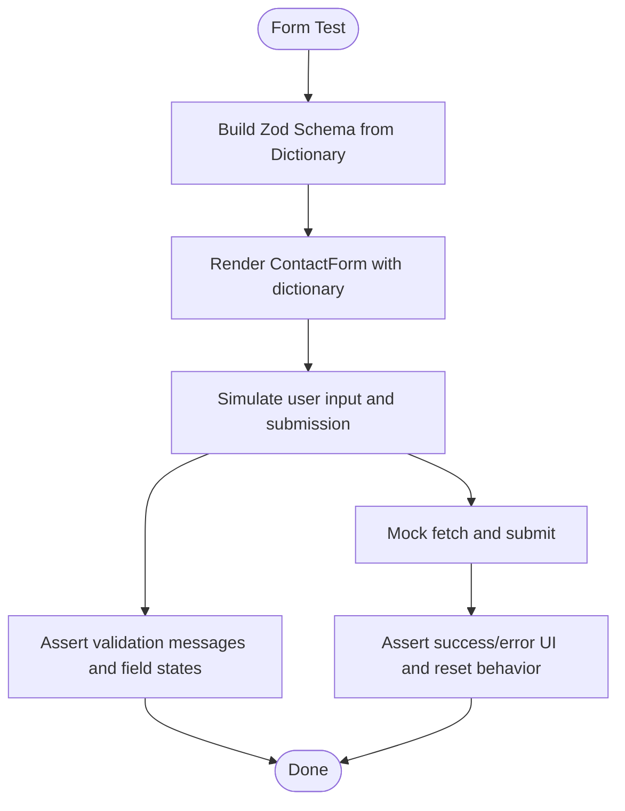
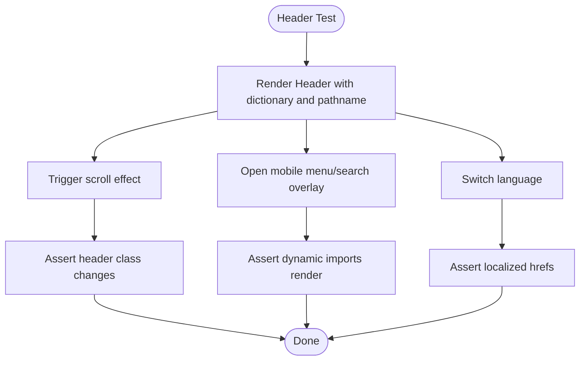
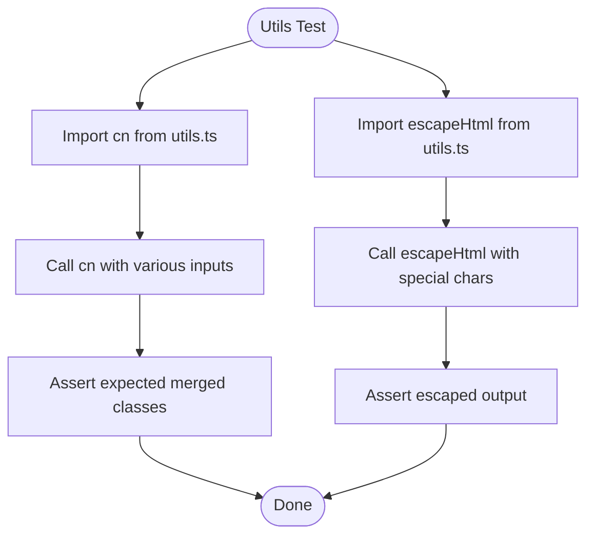
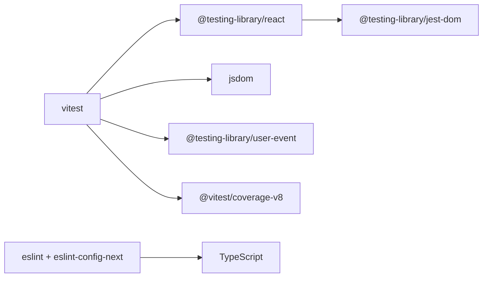

# Testing & Quality Assurance

<cite>
**Referenced Files in This Document**
- [vitest.config.ts](file://vitest.config.ts)
- [eslint.config.mjs](file://eslint.config.mjs)
- [setup.ts](file://src/test/setup.ts)
- [package.json](file://package.json)
- [Hero.test.tsx](file://src/components/ui/__tests__/Hero.test.tsx)
- [Hero.tsx](file://src/components/ui/Hero.tsx)
- [Button.tsx](file://src/components/ui/Button.tsx)
- [ContactForm.tsx](file://src/components/forms/ContactForm.tsx)
- [Header.tsx](file://src/components/layout/Header.tsx)
- [utils.ts](file://src/lib/utils.ts)
- [page.tsx](file://src/app/[lang]/page.tsx)
</cite>

## Table of Contents
1. [Introduction](#introduction)
2. [Project Structure](#project-structure)
3. [Core Components](#core-components)
4. [Architecture Overview](#architecture-overview)
5. [Detailed Component Analysis](#detailed-component-analysis)
6. [Dependency Analysis](#dependency-analysis)
7. [Performance Considerations](#performance-considerations)
8. [Troubleshooting Guide](#troubleshooting-guide)
9. [Conclusion](#conclusion)

## Introduction
This document describes the testing and quality assurance systems for the BGTS web application. It covers the Vitest configuration and runtime setup, React Testing Library patterns, ESLint rules, and practical testing strategies for UI components, forms, and layout elements. It also outlines unit and integration testing approaches, coverage reporting, and CI-friendly practices to maintain code quality.

## Project Structure
The testing and QA setup is organized around:
- Vitest configuration for the test runner and coverage
- A shared setup file for DOM mocks and cleanup
- Component-specific tests under a dedicated test folder
- Linting configuration aligned with Next.js and TypeScript

**Diagram sources**
- [vitest.config.ts:1-29](file://vitest.config.ts#L1-L29)
- [setup.ts:1-35](file://src/test/setup.ts#L1-L35)
- [package.json:5-13](file://package.json#L5-L13)
- [eslint.config.mjs:1-25](file://eslint.config.mjs#L1-L25)
- [Hero.test.tsx:1-59](file://src/components/ui/__tests__/Hero.test.tsx#L1-L59)
- [Hero.tsx:1-245](file://src/components/ui/Hero.tsx#L1-L245)
- [Button.tsx:1-54](file://src/components/ui/Button.tsx#L1-L54)
- [ContactForm.tsx:1-267](file://src/components/forms/ContactForm.tsx#L1-L267)
- [Header.tsx:1-211](file://src/components/layout/Header.tsx#L1-L211)

**Section sources**
- [vitest.config.ts:1-29](file://vitest.config.ts#L1-L29)
- [setup.ts:1-35](file://src/test/setup.ts#L1-L35)
- [package.json:5-13](file://package.json#L5-L13)
- [eslint.config.mjs:1-25](file://eslint.config.mjs#L1-L25)

## Core Components
- Vitest Runner and Coverage
  - Enables jsdom environment, global helpers, CSS support, and a setup file for cleanup and mocks.
  - Uses V8 coverage provider and reports text, json, html.
  - Aliases the @ path to src for consistent imports in tests.
- Test Setup
  - Imports jest-dom matchers and ensures DOM cleanup after each test.
  - Provides mocks for window.matchMedia and IntersectionObserver to avoid browser APIs in tests.
- ESLint Configuration
  - Extends Next.js core-web-vitals and TypeScript configs.
  - Disables specific rules and adjusts global ignores to fit the project structure.
- Test Scripts
  - Provides commands for running tests, UI mode, and coverage reports.

**Section sources**
- [vitest.config.ts:5-29](file://vitest.config.ts#L5-L29)
- [setup.ts:1-35](file://src/test/setup.ts#L1-L35)
- [eslint.config.mjs:5-22](file://eslint.config.mjs#L5-L22)
- [package.json:5-13](file://package.json#L5-L13)

## Architecture Overview
The testing architecture integrates Vitest with React Testing Library and jsdom. Tests run against components rendered in a DOM-like environment, with shared setup for mocks and cleanup. Coverage is generated via V8 and exported in multiple formats.

**Diagram sources**
- [package.json:5-13](file://package.json#L5-L13)
- [vitest.config.ts:7-22](file://vitest.config.ts#L7-L22)
- [setup.ts:1-7](file://src/test/setup.ts#L1-L7)

## Detailed Component Analysis

### Hero Component Testing Pattern
The Hero component tests demonstrate typical UI assertions:
- Rendering text content from props
- Conditional rendering of badges and CTAs
- Attribute checks on interactive elements
- Absence assertions when optional props are omitted

**Diagram sources**
- [Hero.test.tsx:5-58](file://src/components/ui/__tests__/Hero.test.tsx#L5-L58)
- [Hero.tsx:31-244](file://src/components/ui/Hero.tsx#L31-L244)

**Section sources**
- [Hero.test.tsx:1-59](file://src/components/ui/__tests__/Hero.test.tsx#L1-L59)
- [Hero.tsx:15-49](file://src/components/ui/Hero.tsx#L15-L49)

### Form Component Testing Strategy
ContactForm combines form state, validation, and submission. Recommended testing approaches:
- Unit tests for validation logic by constructing the schema with dictionary values and asserting resolver behavior.
- Interaction tests using user-event to simulate typing, checkbox toggling, and form submission.
- Mock fetch to assert network requests and success/error UI states.
- Accessibility checks for labels, roles, and ARIA attributes.

**Diagram sources**
- [ContactForm.tsx:25-77](file://src/components/forms/ContactForm.tsx#L25-L77)

**Section sources**
- [ContactForm.tsx:1-267](file://src/components/forms/ContactForm.tsx#L1-L267)

### Layout Component Testing Strategy
Header involves dynamic imports, scroll effects, and internationalization. Recommended testing approaches:
- Snapshot tests for static markup differences across themes and languages.
- Behavior tests for scroll-triggered class changes and transparent header logic.
- Interaction tests for menu open/close, search overlay toggle, and language switching.
- Dynamic imports can be tested indirectly by verifying that lazy-loaded components render when triggered.

**Diagram sources**
- [Header.tsx:54-209](file://src/components/layout/Header.tsx#L54-L209)

**Section sources**
- [Header.tsx:1-211](file://src/components/layout/Header.tsx#L1-L211)

### Utility Functions Testing Strategy
Utility functions like cn and escapeHtml are pure and suitable for focused unit tests:
- cn: Combine class inputs and assert merged/tailwind-merged output.
- escapeHtml: Verify HTML entity escaping for special characters.

**Diagram sources**
- [utils.ts:4-18](file://src/lib/utils.ts#L4-L18)

**Section sources**
- [utils.ts:1-19](file://src/lib/utils.ts#L1-L19)

## Dependency Analysis
Testing dependencies and their roles:
- Vitest: Test runner and assertion library
- React Testing Library: DOM testing utilities and render helpers
- jsdom: DOM environment for tests
- @testing-library/jest-dom: Extended DOM matchers
- @testing-library/user-event: Simulates user interactions
- @vitest/coverage-v8: V8-powered coverage collection
- ESLint with Next.js presets: Enforces code quality and style

**Diagram sources**
- [package.json:35-51](file://package.json#L35-L51)

**Section sources**
- [package.json:35-51](file://package.json#L35-L51)

## Performance Considerations
- Keep tests focused and fast by avoiding unnecessary DOM queries and relying on semantic selectors.
- Use cleanup after each test to prevent memory leaks and cross-test interference.
- Prefer shallow rendering for leaf components and full rendering for composite components requiring layout.
- Mock external services (like fetch) to eliminate network latency and flakiness.
- Use IntersectionObserver and matchMedia mocks to avoid heavy browser APIs in tests.

## Troubleshooting Guide
Common issues and resolutions:
- Missing DOM Environment
  - Ensure jsdom is configured in Vitest and setup file is loaded.
  - Verify the test environment option and setupFiles path.
- Cleanup and Memory Leaks
  - Confirm afterEach cleanup runs and components are unmounted after each test.
- Browser API Not Available
  - Use provided mocks for window.matchMedia and IntersectionObserver.
- Coverage Reports
  - Adjust excludes in vitest.config.ts if legitimate files are being included unintentionally.
- ESLint Conflicts
  - Align rules with Next.js and TypeScript presets; override selectively as needed.

**Section sources**
- [vitest.config.ts:7-22](file://vitest.config.ts#L7-L22)
- [setup.ts:5-34](file://src/test/setup.ts#L5-L34)
- [eslint.config.mjs:8-22](file://eslint.config.mjs#L8-L22)

## Conclusion
The BGTS web application employs a robust testing and QA setup centered on Vitest, React Testing Library, and comprehensive mocks. The configuration supports reliable unit and integration tests, while ESLint maintains consistent code quality. By following the documented patterns—focusing on component behavior, accessibility, and coverage—the team can sustain high-quality, maintainable UI code across the application.